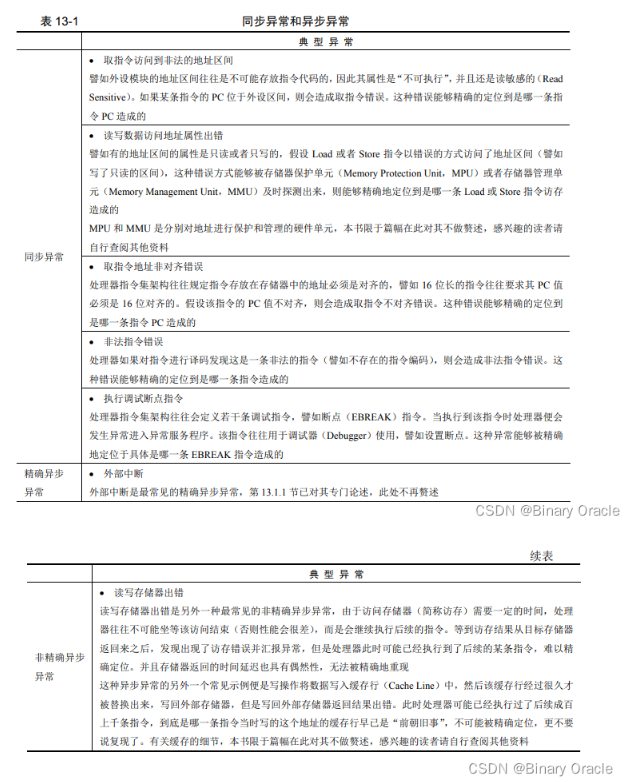
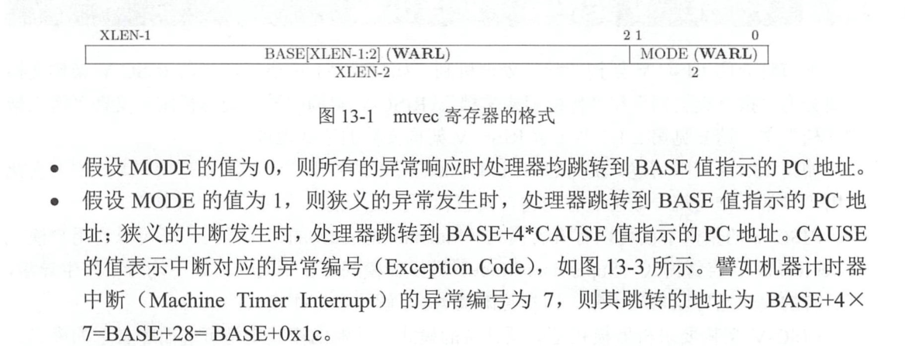

## riscv的分支预测
riscv机构要求在没有硬件分支预测功能的情况下，采用默认的静态分支预测:即向后跳转预测为"跳"，即向前跳转预测为"不跳"
## 特权模式
3种特权模式：机器(Machine)，监督(Supervisor)，用户(User)
> - 如果要上操作系统可能要设置3种模式
> - 存储器地址管理（MPU,MMU），虚拟内存
## CSR寄存器
> - 在附录B里有相关内容

## 异常
- 广义异常
  - 同步异常(能精准定位具体执行指令的异常，常常是内部指令错误引起)
  - 异步异常(不能精准定位具体执行指令的异常，常常是外部中断引起)
    - 精确异步异常
      - 即响应异常后处理器处于指令执行完之后的状态
    - 非精确异步异常
      - 即响应异常后处理器处于指令执行中或者其他模糊状态

常见异常列表

## 异常相关的CSR寄存器(机器模式)
- mtvec(机器模式异常进入基地址寄存器)
  - 
- mcause(机器模式异常原因寄存器)(发生中断就会更新)
  - 定义12种中断和16种异常  
- mepc(机器模式异常返回地址寄存器)(发生中断就会硬件更新)
  - 为什么发生中断时更新为下一条未执行的指令地址(当前被打断的程序该怎么办)
  - 为什么发生中断时更新为下一条未执行的指令地址
- mtval()